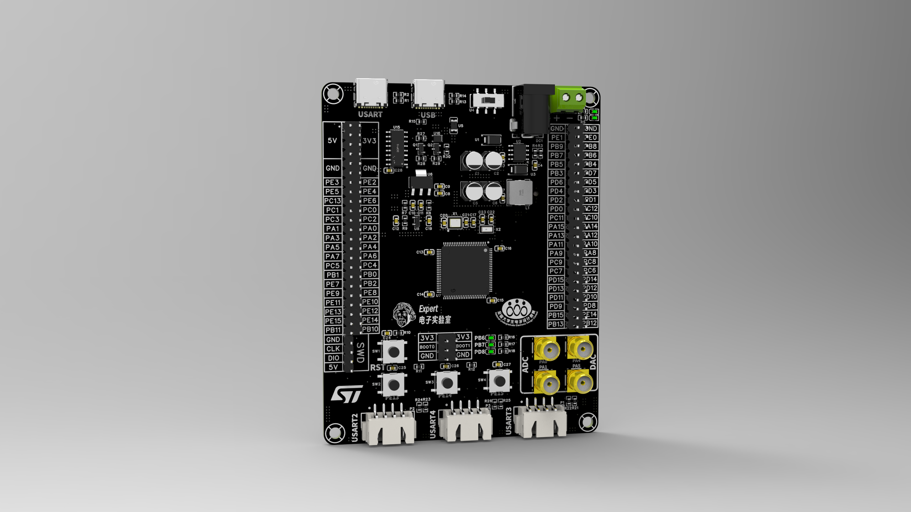

# 项目简介：
STM32电赛开发板是零基础入门PCB设计-国一学长带你学嘉立创EDA专业版的大师篇课程项目，资料中包含工程文件、Gerber文件、课程PPT、数据手册、测试代码。

## B站视频链接：

## 开源资料链接：

# 产品渲染图

# 产品实物图

# STM32F103VET6主控介绍
## 硬件资源
核心处理器：采用 ARM Cortex-M3 内核，具有单周期乘法和硬件除法功能，能够高效地处理各种复杂的运算任务，为芯片的高性能运行提供了坚实的基础。
## 存储资源
闪存：具有 256KB 至 512KB 的闪存空间，可用于存储程序代码和重要数据，满足复杂应用的存储需求。
SRAM：高达 64KB 的静态随机存取存储器，为程序运行时的数据存储和变量运算提供了快速的读写空间。
## 时钟系统
外部晶体振荡器：支持 4 至 16MHz 的晶体振荡器，为系统提供稳定的外部时钟源。
内部 RC 振荡器：包含内部 8MHz 工厂调整 RC 振荡器和内部 40kHz RC 振荡器，其中 40kHz RC 振荡器还带有校准功能，可在不需要高精度外部时钟源的情况下，为系统提供时钟信号，节省成本和电路板空间。
RTC 振荡器：32kHz 振荡器用于 RTC（实时时钟）校准，确保实时时钟的准确性。
## 输入输出端口：
多达 112 个快速 I/O 端口，其中 80 个为可编程 I/O 引脚，这些引脚可以通过软件配置为输入、输出、复用功能等多种模式，可映射到 16 个外部中断向量，方便与外部设备进行连接和交互。
定时器资源：多达 11 个定时器，包括 16 位定时器、电机控制 PWM 定时器、基本定时器等，可用于实现定时、计数、PWM 输出、输入捕获等多种功能，其中 2 个 16 位电机控制 PWM 定时器具有死区时间生成和紧急停止功能，适用于电机控制等应用领域。
## 通信接口
USART：多达 5 个 USART 接口，支持 ISO 7816 接口、LIN、IrDA 功能、调制解调器控制等，可用于实现串口通信，与其他设备进行数据传输和指令交互。

SPI：多达 3 个 SPI 接口，速率可达 18Mbit/s，其中 2 个带 I2S 接口多路复用，可用于连接闪存、传感器、显示屏等外部设备，实现高速数据通信。

I2C：最多 2 个 I2C 接口，支持 SMBus/PMBus 协议，可用于连接各种 I2C 设备，如 EEPROM、传感器、实时时钟芯片等，实现多设备之间的简单通信。

CAN：具有 CAN 接口，适用于工业自动化等领域的设备间通信，能够在恶劣的电磁环境下保证数据的可靠传输。

USB：USB 2.0 全速接口，方便与计算机或其他 USB 设备进行数据交换和通信，可用于实现设备的充电、数据传输、固件升级等功能。

SDIO：SDIO 接口支持与 SD 卡等存储设备连接，实现大容量数据的存储和读取。
## 数据转换模块
ADC：集成了 3 个 12 位 1μs 模数转换器，多达 21 个通道，转换范围为 0 至 3.6V，具有三重采样和保持能力，可用于采集模拟信号，如温度、压力、电压等，并将其转换为数字信号供处理器处理。

DAC：2 个 12 位 D/A 转换器，可将数字信号转换为模拟信号，用于输出模拟电压或电流，如音频信号输出、电机速度控制等。

# 板载资源

1.主控：STM32F103VET6（LQFP封装）

2.电源接口：typec接口（5v）、DC接口（12v）、螺钉式接线端子（12v）

3.下载调试接口：USB转串口或SWD接口

4.LED灯：三个用户LED，两个电源指示灯

5.按键：三个用户按键、一个复位按键

6.排针：将芯片所有GPIO引出，引出BOOT引脚和SWD引脚

7.接口：引出三路串口、一路SPI、一路IIC、两路ADC(SMA接口)、两路DAC(SMA接口)

8.其他：板载电压基准、RTC电池

# 引脚分配图

